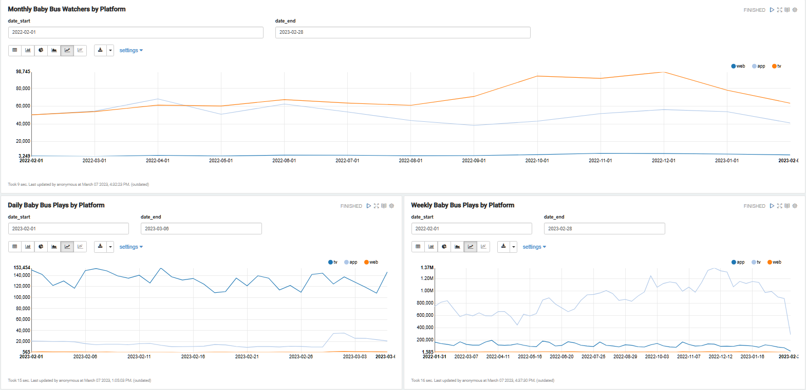
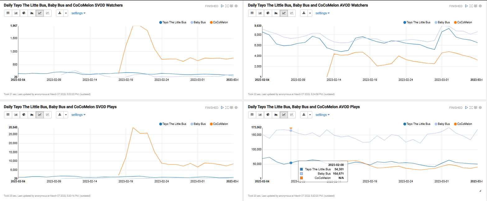

# 📊 Data Analytics & Business Intelligence Portfolio

This repository showcases several **dashboard visualizations** that demonstrate my ability in:

- Data analysis
- Data visualization
- Dashboard development
- Business insight generation
- Data storytelling

The dashboards were created using **Tableau** and are presented as screenshots.

> ⚠️ Note: The original datasets and Tableau files are not included due to data access limitations. The analysis and insights are presented through dashboard screenshots.

---

# 📁 Projects

## 1️⃣ Google Play Store Apps Analysis

### 📊 Dashboard

### 🎯 Objective

Analyze the performance of **mobile game applications in Google Play Store** based on:

- Application rating
- Number of reviews
- Game genre

### 🔎 Analysis

The dashboard visualizes the relationship between:

- App ratings
- Total reviews
- Game genres

This allows us to understand which games have the highest popularity and engagement.

### 📈 Key Insights

- **Sniper 3D Gun Shooter** has the highest number of reviews, reaching more than **46 million reviews**.
- **Garena Free Fire** also shows strong engagement with around **21 million reviews**.
- The **Action genre** dominates the game category in terms of total user engagement.
- High ratings do not always correspond with the highest number of reviews.

### 💡 Business Insight

This analysis can help:

- Game developers identify **popular genres**
- Companies analyze **competitor performance**
- Publishers decide **which game categories have strong market demand**

---

## 🎬 Movie Distribution Analysis

### 🌍 Dashboard

### 🎯 Objective

Analyze the **global distribution of movie releases** by country and observe the **average movie ratings**.

### 🔎 Analysis

This dashboard visualizes:

- Movie production distribution across countries
- Average vote ratings
- Number of movies produced per country

### 📈 Key Insights

- The **United States** produces the highest number of movies in the dataset.
- The average movie rating from the United States is around **6.5**.
- Several European countries such as **UK and Germany** also contribute significantly to global movie production.
- Film production is mostly concentrated in **North America and Europe**.

### 💡 Business Insight

This analysis can help:

- Film distributors identify **key production markets**
- Streaming platforms understand **global movie supply**
- Studios analyze **international production trends**

---

## 📱 Social Media Engagement Analysis

### 📊 Dashboard

### 🎯 Objective

Analyze **social media engagement performance** across different regions and platforms.

### 🔎 Metrics Analyzed

- Views
- Likes
- Comments
- Shares

### 📈 Key Insights

- **USA and UK** generate the highest number of views for video content.
- **YouTube video content** shows the highest engagement compared to other content formats.
- Some regions generate high views but relatively lower likes, indicating differences in **user engagement behavior**.
- Engagement metrics such as **comments and shares** indicate the potential for viral content.

### 💡 Business Insight

This analysis helps marketing teams to:

- Identify **high-performing regions**
- Determine the **best platform for content distribution**
- Optimize **digital marketing strategies**

---

## 🎬 Baby Bus Platform Performance Analysis

### 📊 Dashboard Overview

The dashboard contains three main analyses:

#### 1. Monthly Baby Bus Watchers by Platform

Displays monthly trends of viewers across platforms:

* Web
* App
* TV

Insights:

* TV platform consistently has the highest number of viewers.
* Significant peak occurs around **October – December**, indicating potential seasonal engagement.
* Web traffic shows moderate but stable usage.

---

#### 2. Daily Baby Bus Plays by Platform

Tracks daily play activity to observe short-term fluctuations.

Insights:

* App platform dominates daily plays.
* Certain spikes indicate possible content releases or promotions.
* Web and TV platforms show lower daily activity compared to the mobile app.

---

#### 3. Weekly Baby Bus Plays by Platform

Shows longer engagement patterns across weeks.

Insights:

* Mobile App usage increases steadily during mid-year.
* Engagement peaks toward the end of the year.
* A drop appears at the end of the dataset, possibly due to incomplete data.

---

## 🎬 Kids Streaming Content Analysis (SVOD vs AVOD)

### 📊 Project Overview

This project analyzes the performance of children's streaming content across two different business models:

* **SVOD (Subscription Video On Demand)**
* **AVOD (Advertising Video On Demand)**

The content analyzed in this dashboard includes:

* **Tayo The Little Bus**
* **Baby Bus**
* **CoComelon**

The objective of this analysis is to understand:

* Daily viewer trends
* Content popularity across platforms
* Differences in engagement between subscription and ad-supported models

---

### 📈 Dashboard

The dashboard presents four main metrics:

1. **Daily Watchers (SVOD)**
2. **Daily Watchers (AVOD)**
3. **Daily Plays (SVOD)**
4. **Daily Plays (AVOD)**

These metrics help identify audience engagement and content performance over time.

---

### 🔎 Key Insights

#### 1️⃣ CoComelon experienced a significant spike in SVOD

Around **February 19**, CoComelon shows a sharp increase in both **watchers** and **plays** on SVOD.

Possible reasons may include:

* New episode releases
* Marketing campaigns
* Viral content exposure

---

#### 2️⃣ AVOD generates significantly higher traffic

Compared to SVOD, the **AVOD platform shows much larger engagement levels**:

* Daily plays reach **100K – 170K**
* Daily watchers range from **6K – 9K**

This indicates that **free ad-supported platforms attract a larger audience**.

---

#### 3️⃣ Baby Bus dominates the AVOD platform

Baby Bus consistently shows:

* The **highest number of plays**
* Stable viewer trends

This suggests that **Baby Bus performs very well on ad-supported platforms** where accessibility is higher.

---

#### 4️⃣ Tayo The Little Bus shows stable performance

Tayo maintains a **steady trend across the observed period**, indicating:

* Consistent audience engagement
* Loyal viewer base
* Lower volatility compared to other content

---

## 📈 Key Findings

* **Mobile App is the dominant platform for engagement.**
* **TV platform leads in viewer counts for monthly metrics.**
* **User engagement peaks during Q4 (October – December).**
* Engagement trends suggest seasonal consumption patterns.

---

# 🧠 Skills Demonstrated

This portfolio demonstrates several key data analytics skills:

- Data Visualization
- Dashboard Development
- Exploratory Data Analysis (EDA)
- Data Storytelling
- Business Insight Interpretation
- Analytical Thinking

---

# 🛠 Tools & Technologies

- Tableau
- Metabase
- Microsoft Excel
- Data Visualization Techniques
